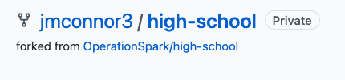

# Step 1. Fork this repo
At the top right corner of the page there will be a button called Fork


Once you press this button you will see this prompt


Click on your username
_________________________

## You should be redirected to the high-school repo. Make sure you see this on the left side of your page


# Step 2. Create gitpod workspace.

Copy this prefixed url ```gitpod.io/#``` and paste it infront of the url for your forked repo.


## Now press enter 
## Note: Gitpod may ask you for permission to access the repo. You will want to give access to github

# Step 3. Activate scripts
run this code
```
chmod u+x setup.sh
./setup.sh
```