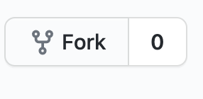
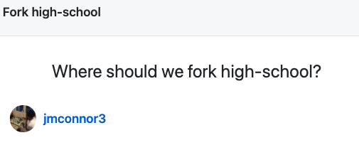

# Set up your Github / Gitpod Workspace

Below, you will find instructions for creating a github repository and setting up your Gitpod workspace. Read all instructions carefully before moving on. If you get stuck, encounter an issue, or simply need help, reach out to your instructor immediately.

# Step 0. Pre-requisites:

Before continuing on to the next steps, make sure that you have done the following:
* Created a personal email account on Gmail.
* Created an account on Greenlight
* Created an account on Github
* Joined the Operation Spark Github Team. You can find your invitation to join this team by going to github.com/OperationSpark.

# Step 1. Fork this repo
At the top right corner of the page there will be a button called Fork



Once you press this button you will see this prompt



Click on your username
_________________________

# Step 2. Create a Gitpod Workspace


1. Go to: <a href=https://gitpod.io>gitpod.io</a>
2. Scroll down to "Get Started" (see above)
3. Paste your GitHub url in the space
4. Click on **Start Workspace**

# Step 3. Install your projects

```
chmod u+x setup.sh
./setup.sh
```

Enter your username and your password.

# Step 4. Pin Your workspace

1. Go to <a href=https://gitpod.io/workspaces/>https://gitpod.io/workspaces/</a>
2. Click on the Pin icon next to your workspace (see below) 


# Step 5. Allow Push Access

Go to: <a href=https://gitpod.io/access-control>gitpod.io/access-control</a>


Check all of the boxes under **Github** and save your preferences.

# Other useful features of Gitpod

## To Preview Your Code


1. Install Live Server (see above)
2. Right Click on `index.html` of the project you are working on and select "Preview with Live Server"

## To Share your Code

Workspace --> Share Running Workspace

Then copy the URL displayed and email it (or post it in chat) to your instructor.


## Set up Auto Save

File --> Auto Save

## To Push Code

Return to your workspace and find the bash terminal.

Then, enter these commands

`git add .`

`git commit -m "describe your changes here"`

`git push`
